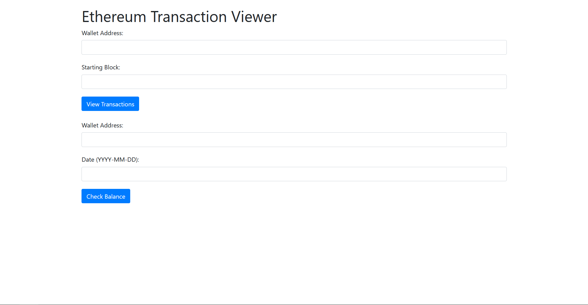
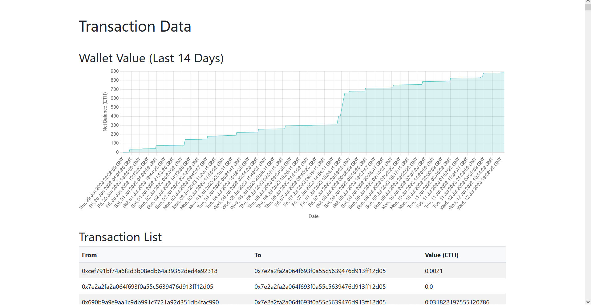
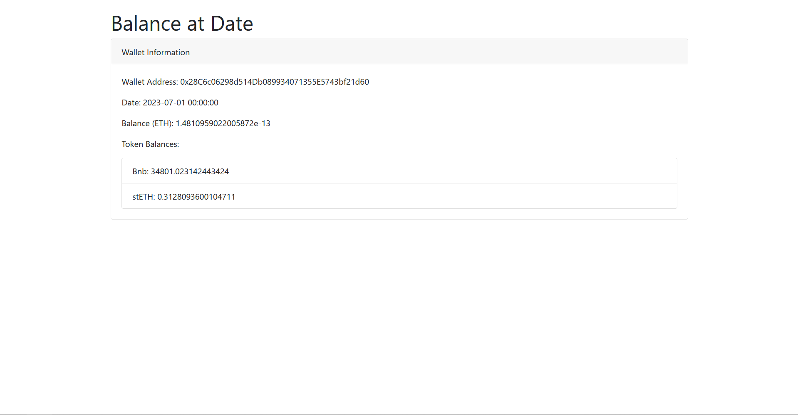

Ethereum transactions crawler task

Easily Explore Wallet Activity and Historical Balances

### Description:

This application allows users to explore transaction data from the Ethereum blockchain associated with a specific wallet address. By providing the desired wallet address (W) and a starting block (B), users can gain insights into wallet activity and monitor the movement of ETH and other tokens.

   
#### Key Features:

1. Ethereum transactions crawler: The application retrieves and presents information on wallets (addresses) and the amounts of ETH associated with transactions made to and from the specified wallet address (W). Users can track the flow of funds and identify transaction trends.
2.  Simple and Human-Readable Presentation: The transaction data is organized and presented in a clear and intuitive manner and can be previewed via simple web page.  
3. Historical Balance Lookup: In addition to real-time transaction data, users can input a specific date in YYYY-MM-DD format and obtain the exact value of ETH and other tokens held by the address at 00:00 UTC on that day.  

#### Demo: 
Index page:

Transactions data example:

Balance look up example:

- Demo:
- Transactions wallet example adress: '0x7e2a2FA2a064F693f0a55C5639476d913Ff12D05'
- block: 9000000
- Balance wallet example adress: '0x28C6c06298d514Db089934071355E5743bf21d60'
- date: '2023-07-01'

##### **Prerequisites**:  
- Python version 3.0 or later
- pip:
- `curl [https://bootstrap.pypa.io/get-pip.py](https://bootstrap.pypa.io/get-pip.py) -o get-pip.py`
- `python get-pip.py`
- Flask: `pip install flask`
- requests: `pip install requests`
- python-dotenv: `pip install python-dotenv`

### How to run

1.  Clone this repo
2.  Navigate to the project root and run main.py `python main.py`
3.  Navigate to the `localhost:5000` in your browser
